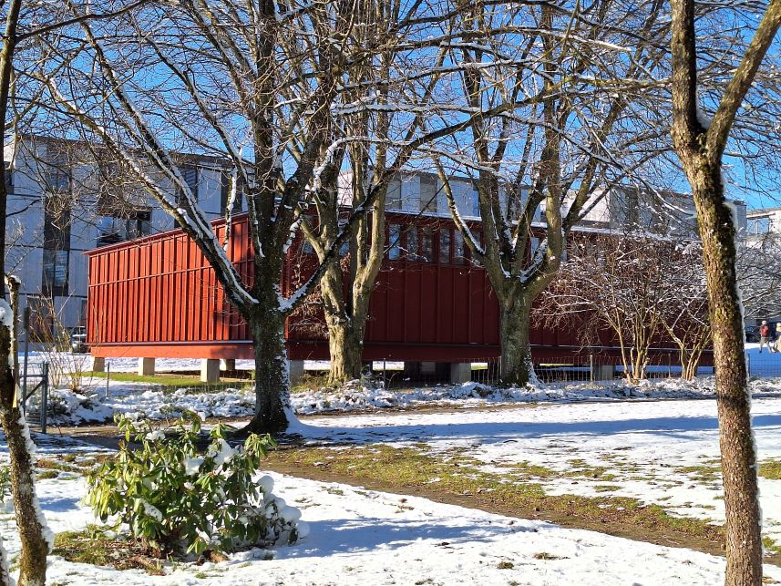

+++
title = "Anders sehen"
date = "2024-02-26"
draft = false
pinned = false
image = "blindenmuseum_richtig.jpg"
description = ""
+++


Mitten in einem Wohnquartier von Zollikofen steht es seit 2020 im neu-en Kleid: Das Schweizerische Blindenmuseum. «Anders sehen» auch wenn alles dunkel ist? Das ist in diesem einzigartigen Lernort dank praktischen Selbsterfahrungen und vielen Sinneseindrücken möglich. Für einen Moment lässt man alle Farben hinter sich, experimentiert mit einem Blindenstock und versucht sich in der Dunkelheit zu orientieren. 

 

**Berühren erlaubt**

xxxx

**Die Welt im Zwielicht**

xxxx

Zitat

Bild 2

**Fast wie im Kino**

xxxx

Infokasten

Schluss